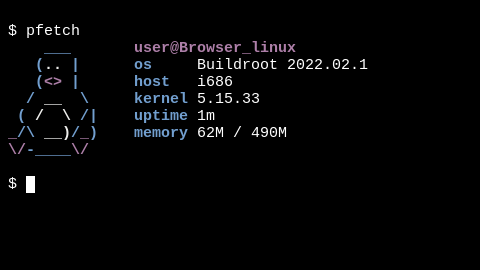

### **browser linux:** _run Linux in your browser_

## [LIVE DEMO](https://darin755.github.io/browser-linux/)

### About

 - browser linux is a project to get a linux command line in the browser

 - It originally ran slitaz but it was moved to a custom buildroot config

   - See https://github.com/Darin755/browser-buildroot

 - It uses the following libraries

   - v86 [link](https://github.com/copy/v86)

   - localforge [link](https://github.com/localForage/localForage)

   - xtermjs [link](https://github.com/xtermjs/xterm.js)

## How to save

 - it can take anywhere from 30-60 sec to boot depending on hardware

 - open the toolbox (the icon at the bottom) and press save now

## License

 - browser-linux itself is under GPLv2 License
 - see LICENSE
