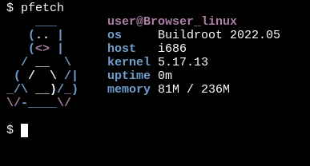

### **browser linux:** _run Linux in your browser_

### **Now on [codeberg](https://codeberg.org/darin755/browser-linux)**

## [LIVE DEMO](https://darin755.github.io/browser-linux/)

*star it if you like it*

### About

 - Browser linux is a project to get a linux command line in the browser

 - It originally ran slitaz but it was moved to a custom buildroot config

   - See https://github.com/Darin755/browser-buildroot

 - It uses the following libraries

   - v86 [link](https://github.com/copy/v86), [LICENSE](https://github.com/Darin755/browser-linux/raw/master/lib/v86/LICENSE)

   - localforge [link](https://github.com/localForage/localForage), [LICENSE](https://github.com/Darin755/browser-linux/raw/master/lib/localForage/LICENSE)

   - xtermjs [link](https://github.com/xtermjs/xterm.js), [LICENSE](https://github.com/Darin755/browser-linux/raw/master/lib/xtermjs/LICENSE)

## How to save

 - it can take anywhere from 30-60 sec to boot depending on hardware

 - open the toolbox (the icon at the bottom) and press save now and/or enable autosave
 - See [saving.md](docs/saving.md)

## How to embed

 - It is actually pretty simple to do.
 - See [Embed.md](docs/embed.md)
 - See the [example](https://darin755.github.io/browser-linux/embed.html)
 
## Documentation
 - How to save: [saving.md](docs.saving.md)
 - How to use the toolbox: [toolbox.md](docs/toolbox.md)
 - url parameters: [parameters.md](docs/parameters.md)
 - internet: [internet.md](docs/internet.md)
 - updates: [updates.md](docs/updates.md)
 - How to embed: [embed.md](docs/embed.md)
 - Static-get: [Static-get.md](docs/static-get.md)
 - Shared fs [9pfs.md](docs/9pfs.md)

## Limitations
 - It is a bit slow
   - It is fine for running simple programs but as soon as you try to run anything that requires cpu it will slow down immensely because the cpu is emulated by v86
 - No Man pages
   - Man pages are to large and are not included. 
 - No reliable package manager
   - static-get get is good for small programs but is not a functional package manager. It also suffers limitations due to internet. See [internet.md](docs/internet.md)

## Contributing
 - The To Do list is located [here](todo.md) but feel free to suggest what you think would be beneficial
 - Don't hesitate to open a issue, pull request or discussion
 - If you would like to see packages added, please open a [discussion](https://github.com/Darin755/browser-linux/discussions)

## License

 - Browser linux itself is under GPLv3 License
 - see LICENSE
